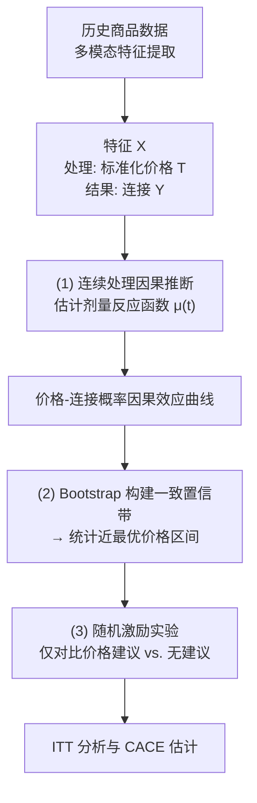

# 基于连续处理因果推断的二手商品挂牌价格区间推荐研究
**——以买家连接行为为响应目标**

## 一、研究背景

### 1.1 二手交易平台的发展现状与定价困境
随着循环经济理念的普及与移动互联网的渗透，二手物品交易平台已成为重要的消费渠道。与标准化新品电商截然不同，二手交易具有“非标品、信息高度不对称、缺乏统一定价参照”三大特征。个人卖家在发布商品时，普遍面临定价困境：定价过高则商品无人问津，定价过低则蒙受不必要的损失。因此，如何为卖家提供科学、可信的定价参考，是二手平台提升发布体验与交易效率的核心痛点。

### 1.2 现有技术方案的局限
当前人工智能在二手平台的应用，主要集中在商品类目识别、属性自动抽取以及基于历史成交价的价格预测。例如，闲鱼I2PS智能发布系统利用多模态模型自动填充商品信息，并基于成交数据训练价格建议模型；基于Grailed、Mercari等平台的研究，也广泛采用机器学习方法预测最终售价。这些方法存在两个根本性局限：

第一，**对成交数据的强依赖**。现有方案几乎全部以最终成交价作为监督信号，这就要求平台必须具备完整的在线交易闭环。然而，大量信息撮合型平台仅提供信息展示与买卖双方沟通功能，无法获取线下成交数据，直接套用此类方法并无可能。

第二，**确定性点预测的不足**。现有模型输出多为单一价格点，既无法量化建议本身的不确定性，也难以向卖家传达“合理区间”的弹性空间。对于一个本身就具有高度不确定性的二手市场，卖家更需要的往往不是一个精确的数字，而是一个有统计保证的参考区间。

### 1.3 本研究的具体场景与问题提出
本研究所在的实习平台正是一个典型的无成交闭环的二手信息平台。平台虽不记录交易价格，但沉淀了丰富的用户行为数据，包括卖家出价、商品曝光、点击，以及最能体现强烈交易意向的**买家发起连接**行为。与此同时，平台已上线商品类目与属性的自动识别能力，为卖家提供了结构化的基础信息填充，但尚未提供任何定价辅助功能。

这一独特的业务场景与技术基础设施，为统计学研究提出了一个全新且极具挑战性的问题：**在已有类目属性自动识别的前提下，能否以买家连接为响应目标，利用历史数据在可观测特征充分控制的条件下估计挂牌价格对连接概率的条件因果效应，进而为卖家推荐一个能显著提升连接概率的合理价格区间，并通过严谨的随机实验加以验证？**

该问题的本质是一个**统计决策与连续处理因果推断**问题。卖家出价与买家连接之间的关系混杂了商品质量、卖家信誉等大量因素，不能简单以相关性建模，而必须借助因果推断方法剥离混杂，在可观测混杂被充分控制的前提下，识别标准化价格对连接概率的剂量反应函数，并在此基础上进行不确定性量化与实验验证。这正是本研究的核心出发点。

## 二、研究意义

### 2.1 理论意义

#### 2.1.1 拓展连续处理因果推断在双边市场中的应用边界
现有因果定价研究多集中于网约车、酒店、保险等存在明确成交记录的场景。本研究首次将广义倾向得分法、连续处理双重稳健估计等方法应用于无成交闭环的C2C信息平台，以“买家连接”作为市场响应代理变量，在充分控制可观测特征的条件下估计标准化相对价格对连接概率的剂量反应函数，丰富了因果推断的实践范畴。

#### 2.1.2 深化统计区间推断在弹性决策中的方法论
区别于文献中普遍的点估计定价模型，本研究致力于构建剂量反应函数的一致置信带，并在此基础上定义**响应最优价格区间**（即平台撮合效率最优的价格区间，而非成交价格或利润最优）。这使得不确定性量化从单纯的预测方差上升到了函数型估计的统计推断层面，为数据驱动的弹性决策提供了严谨的方法论参考。

#### 2.1.3 构建观察性研究与实验性研究的完整闭环
本文设计了一条“观察数据建模→因果效应识别→区间推断→随机激励实验验证”的完整链路。通过将因果模型给出的区间策略在真实的随机激励实验中进行检验，为数据驱动的商业决策提供了严格的统计范式。

### 2.2 实践意义

#### 2.2.1 为海量无交易闭环的信息撮合平台提供可行的定价参考方案
大量二手交易以信息平台形态存在，缺乏成交价数据是普遍痛点。本研究提出的“以买家连接为导向的响应最优价格区间”方案，完全无需依赖成交记录，可直接为此类平台赋能，具有显著的推广应用价值。

#### 2.2.2 提升平台撮合效率与用户体验
合理的价格区间建议能有效减少因盲目高价导致的无效曝光，增加价格合理商品的买家连接机会，从而加速买卖撮合，提升整个平台的活跃度与信息流转效率。

#### 2.2.3 示范统计学在产业AI中的独特价值
本论文将展示连续处理因果推断、Bootstrap区间推断与随机实验设计等统计方法，如何在解决真实业务问题中，提供比纯预测模型更深层的“效应识别”与“不确定性量化”洞察。

## 三、国内外研究现状

### 3.1 二手商品定价预测方法研究
当前二手定价模型几乎全部以最终成交价为预测目标。方法上经历了从线性回归、树集成模型到多模态深度学习的演进。部分研究利用CatBoost融合表格与文本特征预测价格，或使用卷积神经网络提取图像特征并结合文本处理进行定价。闲鱼I2PS系统则通过二分类与回归联合训练判断出价合理性。上述研究均假设可获得成交价作为监督标签，且输出单一确定值，既未考虑无成交数据的信息平台场景，也未从不确定性量化的视角提供价格区间建议。

### 3.2 因果推断在定价与推荐中的应用
近年来，因果推断被广泛用于优化决策。Athey和Imbens提出的因果森林，为异质性处理效应的估计提供了非参数方法。Chernozhukov等人提出的双重/去偏机器学习框架，通过正交化与交叉拟合，实现了在高维混杂下低维因果参数的半参数有效估计。在应用层面，DML和Uplift模型已被用于营销响应、个性化折扣等。然而，在二手商品定价领域，将价格视为连续处理变量并估计其对市场响应的条件因果效应函数，相关工作仍极为稀缺。

### 3.3 连续处理变量的因果推断方法
对于价格、剂量等连续处理变量，研究重点在于估计剂量反应函数或平均结构函数。Hirano和Imbens提出的广义倾向得分法（GPS）是奠基性工作，通过估计给定协变量下连续处理的条件密度来消除混杂。Kennedy等人提出的连续处理双重稳健估计量，利用正交化技术实现了对剂量反应函数的有效估计与推断，能够在结果模型或倾向得分模型之一错误设定时保持一致性。Colangelo和Lee进一步提出了基于核方法的连续处理双重去偏机器学习框架，用于平均剂量反应函数的非参数推断。这些方法为本研究提供了坚实的技术基础，但在二手信息平台场景中尚未见应用。

### 3.4 在线随机实验与不确定性量化
在线A/B实验是检验因果效应的黄金标准。Kohavi等人系统阐述了大规模在线实验的设计原则与评估方法。意向治疗分析（ITT）和工具变量法（用于估计依从者平均因果效应，CACE）是处理用户依从性问题的标准统计工具。在不确定性量化方面，Bootstrap是构建函数型置信带的常用非参数方法，尤其适用于本研究中剂量反应函数这一无穷维目标的推断。

### 3.5 研究现状述评
现有研究要么依赖成交价，要么给出点预测，且多止步于离线评估。对于已有属性自动识别基础但无成交数据的信息平台，如何从连续处理因果推断视角，构建具有统计保证的响应最优价格区间，并借助随机激励实验加以验证，构成了明确的研究缺口，也正是本论文的切入点。

## 四、研究内容

### 4.1 连续处理下的价格条件因果效应识别
- 构造标准化相对价格（同品类、品牌、型号、成色下的价格分位数）作为连续处理变量，“发布后7天内是否获得买家连接”为二值结果变量。
- 在高维多模态特征控制下，明确弱可忽略性、正值性和SUTVA等识别假设，并进行协变量平衡诊断与公共支撑区间分析。
- 分别采用广义倾向得分法和连续处理双重稳健估计量，在可观测特征充分控制的条件下，估计挂牌价格对连接概率的剂量反应函数，并探索效应的异质性。

### 4.2 统计最优价格区间的构建与推断
- 基于Bootstrap重抽样，构建剂量反应函数的一致置信带。
- 定义**响应最优价格区间**：在给定置信水平下，与最高连接概率在统计上无显著差异的价格范围，为卖家提供有统计保证的弹性建议。注意该区间以平台撮合效率为优化目标，不代表真实成交价格或利润最优。
- 通过模拟实验评估覆盖率，在真实数据中评估区间宽度与稳定性。

### 4.3 在线随机激励实验验证
- 在平台已有类目属性自动识别的基础上，设计并实施随机激励实验：实验组在发布流程中被展示“建议价格区间”，对照组无任何价格建议。
- 采用卖家级随机化，彻底避免同一卖家多商品的组间污染。
- 通过ITT分析检验策略的整体效果，并利用工具变量法估计实际采纳建议对连接概率的局部平均处理效应（作为补充分析），完成因果闭环验证。

## 五、研究思路

本论文遵循“定义目标→识别因果→区间推断→实验验证”的统计研究逻辑，整体研究思路如下图所示：

核心思路在于：不将价格与连接的关系视为简单的相关性，而是明确为存在混杂的因果问题；处理变量采用标准化相对价格分位数以增强可比性；实验中严格将干预限制为价格区间建议，确保因果效应的干净识别；结论限定为“以连接为导向的响应最优区间”，而非成交价或利润最优。

## 六、研究方法

### 6.1 样本限定与变量定义
- **样本选择**：优先选择1-3个高频、属性稳定、样本量充足的品类（如手机、平板电脑），保证模型估计的稳定性和内部有效性。
- **处理变量T**：主方案采用**同品类、同品牌、同型号、同成色下的挂牌价格分位数**，将绝对价格转化为相对位置，确保跨商品可比。作为稳健性检验，尝试“挂牌价偏离同类目基准价的标准化距离”。
- **结果变量Y**：定义为“发布后7天内是否获得至少一次买家有效连接”。
- **控制变量X**：利用平台已有的类目属性体系、预训练多模态模型提取的图像与文本嵌入向量作为控制变量。特别注意避免将曝光、点击等可能的中介变量作为控制变量。

### 6.2 观察性因果识别与估计
- **识别假设**：明确弱可忽略性（给定X后T与潜在结果独立）、正值性（GPS在X的所有取值下有充分重叠）和SUTVA，并逐一讨论其合理性。充分认识到存在未观测混杂（如卖家急售程度、商品暗伤等），因此将结论表述为“在可观测特征充分控制条件下的条件因果效应”。
- **协变量平衡诊断**：使用广义倾向得分加权后，检查标准化均值差等平衡性指标，绘制公共支撑区间图，对极端样本进行修剪。
- **剂量反应函数估计**：
  - 基准方法：Hirano-Imbens广义倾向得分法，分两步估计平均剂量反应函数 μ̂(t)。
  - 增强方法：Kennedy等人连续处理双重稳健估计量，以及Colangelo与Lee的核方法双重去偏框架，获得 μ(t) 的半参数有效估计与置信区间。
  - 异质性探索：按品类、成色等关键变量分层，估计条件剂量反应函数。

### 6.3 统计最优区间推断
- **Bootstrap函数型置信带**：对整个估计流程进行B=1000次重抽样，构建 μ(t) 的一致置信带。
- **响应最优区间定义**：识别 μ̂(t) 的最大值点 t̂_opt，在95%置信水平下，定义区间为所有与最大响应无显著差异的价格集合。此区间解读为“平台撮合效率最优价格区间”，而非成交价格或卖家收益最优。
- **区间性质评估**：覆盖率和平均宽度主要通过模拟实验评估；在真实数据中报告区间宽度、跨样本稳定性和与业务经验的吻合度。

### 6.4 在线随机激励实验设计
- **设计前提**：平台已统一上线类目属性自动识别，实验组与对照组在类目属性填充、标题描述填写等方面完全一致，唯一差异是实验组额外展示建议价格区间。
- **随机化单位**：**采用卖家级随机化**。以卖家为随机单位，确保同一卖家发布的所有商品均处于同一实验组，从根本上避免商品级随机的组间污染。
- **样本量与功效**：基于历史连接率、预设最小可检测效应量（如连接率相对提升10%），在显著性水平0.05、功效80%下计算所需卖家数量及运行周期。
- **统计分析**：
  - **主分析（ITT）**：在卖家层面比较两组商品的平均连接率，使用双样本比例检验，标准误考虑卖家聚类。
  - **补充分析（CACE）**：将“卖家挂牌价落入建议区间”定义为依从，以随机分组为工具变量，通过两阶段最小二乘法估计采纳建议对连接率的局部平均处理效应。注意工具变量假设（如排除限制）可能不完全成立，故CACE仅作为探索性补充，主要结论基于ITT。
- **机制分析与干扰控制**：与平台运营方确认实验期间无额外人工干预。将曝光量和点击量作为次级结果变量或机制分析变量，避免纳入主效应回归，以保持总效应解释的清晰性。

## 七、技术路线

1.  **数据准备**：抽取近半年商品数据，清洗记录，利用平台已有类目属性体系进行标签映射，标注连接标签，构建标准化价格分位数处理变量。
2.  **特征工程**：利用预训练多模态模型提取图像与文本嵌入向量，结合结构化属性形成控制变量矩阵。平台已上线的类目属性识别仅作为特征构建工具，不单独展开研究。
3.  **观察性建模**：
    -   协变量平衡诊断与公共支撑区间分析。
    -   使用GPS和连续处理双重稳健估计量估计剂量反应函数，分析异质性。
    -   Bootstrap构建置信带，计算响应最优价格区间。
4.  **在线实验**：
    -   完成样本量与功效计算，开发卖家级随机分流与价格建议展示功能。
    -   部署并运行随机激励实验2-4周。
    -   收集数据，进行ITT分析及CACE补充估计，完成机制探讨。
5.  **结果汇总与论文撰写**：整合分析结论，撰写论文。

## 八、可行性分析

- **数据可行性**：平台拥有充足的历史行为数据与在线实验能力。“买家连接”作为市场响应代理变量，数据可得且业务含义清晰。
- **理论与技术可行性**：连续处理因果推断、Bootstrap和随机实验设计均为成熟方法，有EconML、DoubleML等软件包支持。多模态特征可借助预训练模型提取，成本可控。
- **实验可行性**：价格区间建议为温和干预，不强制卖家行为，实验风险低。平台已上线的类目属性识别为两组提供了统一基础设施，卖家级随机也易于在发布环节实现，确保干预纯净。
- **工作量与深度**：三个核心内容层层递进，统计深度充足。辅助特征工程仅作为工具简述，整体工作量在一名硕士研究生的能力与时间范围内可完成。

## 九、论文整体框架

### 第1章 绪论
#### 1.1 研究背景
##### 1.1.1 二手交易平台的发展现状与定价困境
##### 1.1.2 现有技术方案的局限与不足
##### 1.1.3 本研究的具体场景与问题提出
#### 1.2 研究目的与意义
##### 1.2.1 研究目的
##### 1.2.2 理论意义
##### 1.2.3 实践意义
#### 1.3 研究内容与方法概述
##### 1.3.1 核心研究内容
##### 1.3.2 研究方法概述
##### 1.3.3 技术路线概览
#### 1.4 论文结构安排

### 第2章 文献综述与理论基础
#### 2.1 二手商品定价预测方法
##### 2.1.1 基于传统机器学习的定价预测
##### 2.1.2 基于多模态深度学习的定价预测
##### 2.1.3 现有方法的局限与本研究的定位
#### 2.2 因果推断基础理论
##### 2.2.1 潜在结果框架与识别假设
##### 2.2.2 倾向得分方法的基本原理
##### 2.2.3 双重机器学习框架
#### 2.3 连续处理变量的因果推断方法
##### 2.3.1 广义倾向得分法的理论基础
##### 2.3.2 连续处理双重稳健估计
##### 2.3.3 剂量反应函数的估计与推断
#### 2.4 在线随机实验设计与分析
##### 2.4.1 随机对照实验的基本原理
##### 2.4.2 随机激励实验设计
##### 2.4.3 意向治疗分析与依从者因果效应估计
#### 2.5 不确定性量化与Bootstrap方法
##### 2.5.1 Bootstrap的基本原理
##### 2.5.2 函数型置信带的构建
##### 2.5.3 响应最优区间的统计推断
#### 2.6 本章小结

### 第3章 数据描述与特征工程
#### 3.1 数据来源与样本构成
##### 3.1.1 平台数据概述
##### 3.1.2 样本抽取策略与时间窗口
##### 3.1.3 品类选择与样本规模
#### 3.2 变量定义与构造
##### 3.2.1 处理变量：同品类-品牌-型号-成色下的价格分位数
##### 3.2.2 结果变量：买家连接的定义与标注
##### 3.2.3 控制变量体系
#### 3.3 多模态特征提取
##### 3.3.1 图像特征提取
##### 3.3.2 文本特征提取
##### 3.3.3 结构化属性编码
#### 3.4 探索性数据分析
##### 3.4.1 价格分布特征
##### 3.4.2 连接率分布与影响因素初探
##### 3.4.3 价格与连接的相关性可视化
#### 3.5 本章小结

### 第4章 连续处理下的价格条件因果效应估计
#### 4.1 因果识别框架
##### 4.1.1 识别假设的设定与讨论（含未观测混杂的坦诚说明）
##### 4.1.2 弱可忽略性条件的合理性论证
##### 4.1.3 正值性与公共支撑区间的讨论
#### 4.2 协变量平衡诊断与预处理
##### 4.2.1 广义倾向得分的估计
##### 4.2.2 协变量平衡性检验
##### 4.2.3 公共支撑区间分析与样本修剪
#### 4.3 基于广义倾向得分法的剂量反应函数估计
##### 4.3.1 模型设定与估计步骤
##### 4.3.2 平均剂量反应函数的估计结果
##### 4.3.3 结果解读与可视化
#### 4.4 基于双重稳健估计的剂量反应函数估计
##### 4.4.1 连续处理双重稳健估计量的构造
##### 4.4.2 核方法双重去偏框架的应用
##### 4.4.3 两种方法的估计结果对比
#### 4.5 异质性分析
##### 4.5.1 按品类的分层估计
##### 4.5.2 按成色的分层估计
##### 4.5.3 异质性结果的业务解读
#### 4.6 稳健性检验
##### 4.6.1 不同价格标准化方式的敏感性分析
##### 4.6.2 不同样本子集的重估计
##### 4.6.3 未观测混杂的敏感性分析
#### 4.7 本章小结

### 第5章 统计最优价格区间的构建与推断
#### 5.1 函数型置信带的构建方法
##### 5.1.1 Bootstrap重抽样方案设计
##### 5.1.2 逐点置信区间与同时置信带的区别
##### 5.1.3 一致置信带的构建步骤
#### 5.2 响应最优价格区间的定义与求解
##### 5.2.1 最优价格点的识别
##### 5.2.2 响应最优区间的形式化定义
##### 5.2.3 区间的数值求解算法
#### 5.3 区间性质的模拟评估
##### 5.3.1 模拟实验设计
##### 5.3.2 覆盖率的评估结果
##### 5.3.3 平均宽度的评估结果
#### 5.4 真实数据中的区间特征分析
##### 5.4.1 各品类最优价格区间的实证结果
##### 5.4.2 区间宽度的影响因素分析
##### 5.4.3 跨样本稳定性评估
#### 5.5 与业务经验的对比验证
##### 5.5.1 平台运营经验的价格区间参考
##### 5.5.2 模型区间与经验区间的对比
##### 5.5.3 差异分析与讨论
#### 5.6 本章小结

### 第6章 在线随机激励实验设计与验证
#### 6.1 实验背景与前提条件
##### 6.1.1 平台类目属性自动识别的已上线状态
##### 6.1.2 实验组与对照组的共同基础设施
##### 6.1.3 干预的单一性保证
#### 6.2 实验设计方案
##### 6.2.1 卖家级随机激励实验的总体框架
##### 6.2.2 随机化单位的确定与理由
##### 6.2.3 实验组的价格区间展示设计
#### 6.3 样本量与功效计算
##### 6.3.1 历史连接率的基准估计
##### 6.3.2 最小可检测效应量的设定
##### 6.3.3 所需样本量与运行周期的计算
#### 6.4 实验实施与数据收集
##### 6.4.1 实验功能开发与埋点
##### 6.4.2 实验部署与运行监控
##### 6.4.3 数据收集与质量检验
#### 6.5 实验结果分析
##### 6.5.1 随机化检验与基线平衡
##### 6.5.2 意向治疗分析（ITT）结果
##### 6.5.3 依从者因果效应（CACE）估计（补充分析）
#### 6.6 机制分析与讨论
##### 6.6.1 曝光量与点击量的机制分析
##### 6.6.2 采纳率的影响因素分析
##### 6.6.3 实验结果的业务解读
#### 6.7 实验局限与改进方向
##### 6.7.1 样本代表性与外部有效性
##### 6.7.2 干扰因素的残余影响
##### 6.7.3 长期效应的追踪需求
#### 6.8 本章小结

### 第7章 总结与展望
#### 7.1 研究工作总结
##### 7.1.1 观察性因果建模的主要结论
##### 7.1.2 区间推断的方法论贡献
##### 7.1.3 实验验证的核心发现
#### 7.2 研究创新点
##### 7.2.1 场景创新
##### 7.2.2 方法创新
##### 7.2.3 验证创新
#### 7.3 研究局限
##### 7.3.1 代理变量：连接率不等于成交率的固有局限
##### 7.3.2 未观测混杂的潜在威胁
##### 7.3.3 外部有效性的边界
#### 7.4 未来研究方向
##### 7.4.1 向多目标定价优化拓展
##### 7.4.2 个性化价格区间的探索
##### 7.4.3 长期效应的追踪与强化学习框架

## 十、国内外参考文献

[1] Hirano, K., & Imbens, G. W. (2004). The propensity score with continuous treatments. In *Applied Bayesian modeling and causal inference from incomplete-data perspectives* (pp. 73-84). Wiley.
[2] Athey, S., & Imbens, G. (2016). Recursive partitioning for heterogeneous causal effects. *Proceedings of the National Academy of Sciences*, 113(27), 7353-7360.
[3] Chernozhukov, V., Chetverikov, D., Demirer, M., et al. (2018). Double/debiased machine learning for treatment and structural parameters. *The Econometrics Journal*, 21(1), C1-C68.
[4] Kennedy, E. H., Ma, Z., McHugh, M. D., & Small, D. S. (2017). Nonparametric methods for doubly robust estimation of continuous treatment effects. *Journal of the Royal Statistical Society: Series B*, 79(4), 1229-1245.
[5] Imbens, G. W., & Rubin, D. B. (2015). *Causal Inference for Statistics, Social, and Biomedical Sciences*. Cambridge University Press.
[6] Kohavi, R., Tang, D., & Xu, Y. (2020). *Trustworthy Online Controlled Experiments: A Practical Guide to A/B Testing*. Cambridge University Press.
[7] Angrist, J. D., Imbens, G. W., & Rubin, D. B. (1996). Identification of causal effects using instrumental variables. *Journal of the American Statistical Association*, 91(434), 444-455.
[8] Efron, B., & Tibshirani, R. J. (1993). *An Introduction to the Bootstrap*. Chapman & Hall.
[9] 王斌, 李伟. (2023). 基于多模态学习的二手商品价格预测研究. *计算机应用研究*, 40(2), 456-462.
[10] 张强, 刘洋. (2022). 融合文本与图像的闲置物品价格评估模型. *数据分析与知识发现*, 6(5), 112-124.
[11] Colangelo, K., & Lee, Y. Y. (2020). Double debiased machine learning for continuous treatment effects. *arXiv preprint arXiv:2004.03036*.
[12] Zhao, Y., & Udell, M. (2020). Causal inference with double machine learning: A practical guide. *arXiv preprint arXiv:2006.15667*.
[13] 张华, 李明. (2023). 因果推断在互联网行业应用综述. *统计与决策*, 39(8), 89-96.
[14] Hall, P. (1992). *The Bootstrap and Edgeworth Expansion*. Springer.
[15] Robins, J. M., Hernán, M. A., & Brumback, B. (2000). Marginal structural models and causal inference in epidemiology. *Epidemiology*, 11(5), 550-560.
[16] Austin, P. C. (2019). Assessing covariate balance when using the generalized propensity score with quantitative or continuous exposures. *Statistical Methods in Medical Research*, 28(5), 1365-1377.
[17] Imbens, G. W. (2000). The role of the propensity score in estimating dose-response functions. *Biometrika*, 87(3), 706-710.
[18] Imbens, G. W. (2000). The role of the propensity score in estimating dose-response functions. *Biometrika*, 87(3), 706-710.
[19] Gong, J., et al. (2025). Visual zero-shot e-commerce product attribute value extraction. In *Proceedings of the NAACL 2025 Industry Track*.
